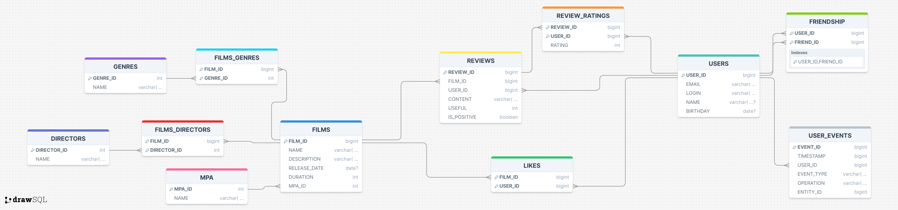

# 🎬 Filmorate — Social Platform for Film Rating

## 🌟 Project Overview

**Filmorate** is a social service designed for users to rate movies, exchange opinions, manage friend lists, and receive personalized recommendations.

The project is implemented using the **Controller-Service-Repository (DAO)** architecture, relying on Spring JDBC for direct interaction with the database.

### Status
| Metric | Value |
| :--- | :--- |
| API Version | v1 |
| Language | Java 21 |
| Build System | Maven |
| Database | H2 (in-memory) |

---

## 🛠️ Technology Stack

| Category | Technologies |
| :--- | :--- |
| **Backend** | **Java 21**, **Spring Boot 3.2.4** |
| **Data Access** | **Spring JDBC** (`NamedParameterJdbcOperations`) |
| **Database** | **H2 Database** (for development) |
| **Utilities** | **Lombok** (`@Data`, `@Slf4j`), **Jakarta Validation** |
| **Logging** | **SLF4J/Logback**, **Zalando Logbook** (for HTTP traffic logging) |
| **Testing** | JUnit 5, Mockito, Spring Boot Starter Test |

---

## ✨ Core Features

### 👥 Users and Social Graph
* **CRUD** operations for user profiles.
* **Friendship**: Adding and removing friends.
* Retrieval of **common friends** (mutual friends) between two users (optimized via SQL).
* **Activity Feed**: Logging user actions (adding/removing friends, likes, reviews) to a chronological feed.

### 🎞️ Films and Ratings
* **CRUD** operations for films.
* **Validation**: Ensuring films comply with **MPA** ratings and **Genre** data.
* **Likes**: Users can add and remove likes, influencing popularity.
* **Directors**: Full support for assigning and querying films by **Directors**.
* **Search**: Searching films by **Title** and/or **Director** name.
* **Popularity**: Retrieval of the top popular films with filtering by **Year** and **Genre**.
* **Recommendations**: Personalized film suggestions based on similar user preferences (Collaborative Filtering).

### ✍️ Reviews and Usefulness Score
* **CRUD** operations for reviews.
* Reviews are linked to a specific film and user.
* **Usefulness Score**: Users can add likes and dislikes to reviews, dynamically calculating the overall usefulness score.

---

## 🚀 Installation and Launch

To run the project locally, you must have **Java 21** and **Maven** installed.

1.  **Clone the repository:**
    ```bash
    git clone <REPOSITORY_URL>
    cd filmorate
    ```

2.  **Build the project:**
    ```bash
    ./mvnw clean install
    ```

3.  **Run the application:**
    ```bash
    java -jar target/filmorate-0.0.1-SNAPSHOT.jar
    # OR: mvn spring-boot:run
    ```

4.  **Database Initialization:** The application uses **H2** in in-memory mode. The database schema (`schema.sql`) and initial reference data (`data.sql`) are loaded automatically by Spring Boot upon startup. The API is available at: `http://localhost:8080`.

---

## 🔗 Key API Endpoints

| Resource | Method | URI | Description |
| :--- | :--- | :--- | :--- |
| **Users** | `GET` | `/users` | Get all users |
| | `POST` | `/users` | Create a user |
| | `GET` | `/users/{id}/friends/common/{otherId}` | Get mutual friends |
| | `GET` | `/users/{id}/feed` | Get user activity feed |
| **Films** | `GET` | `/films` | Get all films |
| | `GET` | `/films/popular` | Get popular films (supports filters `genreId`, `year`) |
| | `PUT` | `/films/{id}/like/{userId}` | Add a like to a film |
| | `GET` | `/films/search?query=...&by=...` | Search for films |
| **Reviews** | `POST` | `/reviews` | Create a new review |
| | `PUT` | `/reviews/{id}/like/{userId}` | Add a like to a review (positive usefulness) |
| **Reference** | `GET` | `/mpa` | Get all MPA ratings |
| | `GET` | `/genres` | Get all genres |
| | `GET` | `/directors` | Get all directors |

---

## 💻 ER diagram



---